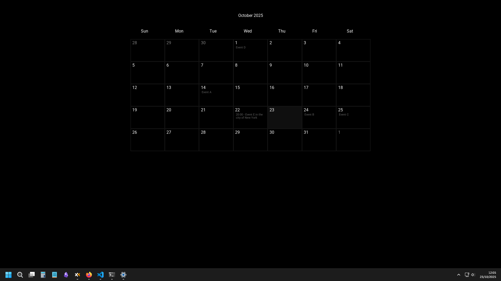

# 📅 Calendar Wallpaper Generator

A Python application that generates calendar images with your events and optionally sets them as your desktop wallpaper. Comes with both a **command-line interface** and a **graphical user interface (GUI)** for easy event management.

GUI


---

Desktop with Calendar Wallpaper




---

## ✨ Features

- **Dual Interface**: Use the CLI for quick generation or the GUI for intuitive event management.
- **Event Support**: Add time-specific or all-day events via SQLite database
- **Customizable Styling**: Configure colors, fonts, image dimensions, and more via `config.py`.
- **Wallpaper Integration**: Automatically set the generated calendar as your desktop background.
- **Current Day Highlight**: Today’s date is visually highlighted on the calendar.
- **Responsive Layout**: Events are automatically wrapped to fit within day cells.
- **Cross-Plataform**: Linux, macOS, and Windows.

---

## 📦 Requirements

- Python
- Required packages:
  - `Pillow` (for image generation)
  - `tkcalendar` (for GUI date picker)
  - `ttkthemes` (for modern GUI styling)

Install dependencies with:

[Astral uv](https://github.com/astral-sh/uv)
```bash
uv install
```

or

```bash
pip install pillow, tkcalendar, ttkthemes
```

---

## 🗂️ Project Structure

```
wallpaper_manager/                        # Root directory of the project
│
├── assets/                               # Folder for assets like images or README assets
│   └── (image files, etc.)                # Any asset-related files
│
├── cli/                                  # CLI-related scripts
│   ├── __init__.py                       # Makes this folder a package
│   └── cli.py                            # Main CLI script
│
├── config/                               # Configuration settings for the app
│   └── config.py                         # App configuration settings (e.g., logging, paths)
│
├── db/                                   # Database-related files
│   └── events.sqlite3                    # SQLite database for storing events
│
├── fonts/                                # Folder for font files used by the app
│   └── (font files)                      # Font files used in calendar generation
│
├── gui/                                  # GUI-related scripts
│   ├── __init__.py                       # Makes this folder a package
│   └── gui.py                            # Main GUI script
│
├── models/                               # Core logic and models
│   ├── calendar_image_gen.py             # Contains logic for generating calendar images
│   └── common.py                         # Shared functions and classes used by both CLI and GUI
│
├── output/                               # Output directory for logs, images, and generated content
│   ├── app.log                           # Log file generated by the app (e.g., logger outputs)
│   └── calendar.png                      # Generated calendar image (output from the app)
│
├── utils/                                # Utility functions or helpers
│   ├── logger.py                         # Logging setup and functions for the app
│   └── shared_utils.py                   # Other shared utilities (e.g., date or file handling)
│
├── .gitignore                            # Specifies files and directories to be ignored by Git
├── .python-version                       # File specifying the Python version for uv
├── pyproject.toml                        # uv project configuration file
├── README.md                             # Project documentation (what the project does, how to use it)
├── run_cli.bat                           # Batch script to activate virtual environment and run CLI
├── run_gui.bat                           # Batch script to activate virtual environment and run GUI
└── uv.lock                               # uv project lock file (used for project environment management)

```

---

## ⚙️ Configuration (`config.py`)

Customize your calendar by editing `config.py`:

- `BACKGROUND_COLOR`: Hex code or RGB tuple for background (e.g., `"#2e2e2e"` or (46,46,46))
- `GRID_COLOR`: Calendar grid color
- `TEXT_COLOR`: General color for Month's Title, Day of Week and Day's Digit color
- `EVENT_COLOR`: Color for list of events
- `TODAY_EVENT_COLOR`, `TODAY_CELL_BG_COLOR`: Colors when cell is the current day
- `IMG_WIDTH`, `IMG_HEIGHT`: Output image resolution
- `FONT_FILE`: Path to `.ttf` font (falls back to default if missing)
- `WALLPAPER_FILE`: Output path for generated image
- `EVENTS_DB_FILE`: SQLite database path

> 💡 **Tip**: Use dark backgrounds with light text for better readability as a wallpaper!

---

## 🖥️ Command-Line Usage

Generate a calendar for the current month:

```bash
python -m cli.cli
```

### Options

| Flag | Description | Example |
|------|-------------|---------|
| `--year`,`-y` | Specify year | `--year 2025` |
| `--month`,`-m` | Specify month (1–12) | `--month 12` |
| `--start-week`,`-sw` | First day: `sun` (default) or `mon` | `--start-week mon` |
| `--wallpaper`,`-w` | Set output as desktop wallpaper | `--wallpaper` |
| `--database`,`-d` | Custom SQLite path | `--db my_events.db` |

**Example**:  
```bash
python -m cli.cli --year 2024 --month 12 --start-week mon --wallpaper --database events.db
```

---

## 🖱️ Graphical User Interface

Launch the GUI to manage events visually:

```bash
python -m gui.gui
```

### GUI Features:
- Add, edit, or delete events with date/time picker
- Toggle "Full Day Event" (sets time to `00:00`)
- Real-time event list with sorting
- One-click "Publish Calendar Image" (with wallpaper option)
- Refresh to sync with database

> ✅ The GUI automatically initializes the SQLite database on first run.

---

## 📝 Event Formats

### SQLite Database
Table schema:
```sql
CREATE TABLE events (
    id INTEGER PRIMARY KEY,
    title TEXT NOT NULL,
    event_datetime TEXT NOT NULL  -- Format: "YYYY-MM-DD HH:MM"
);
```

> ⚠️ Events with `00:00` time are displayed without a timestamp (all-day events).


---

## Automation

Example use Task Scheduler to execute `.bat` or bash `.sh` script to generate and set the calendar wallpaper on user login.

Included `run_cli.bat` to execute the python script using virtual enviroment `.venv/` that can be used with Task Scheduler.

---

## 📜 License

## Roboto Font

The Roboto font is copyrighted by Google and licensed under the Open Font License, [OFL License v1.1](https://openfontlicense.org/documents/OFL.txt).